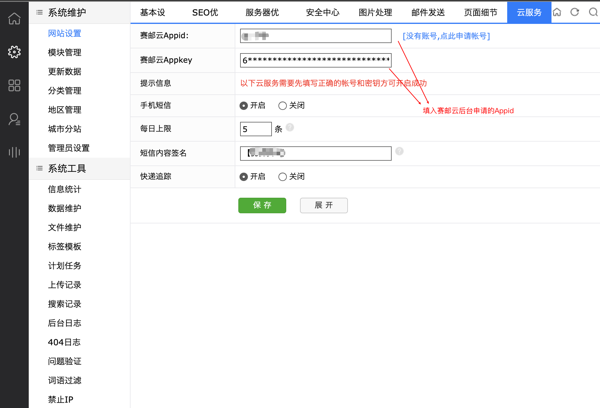

## OVERVIEW

### DESTOON B2B网站管理系统 Plug-Ins Overview

------
	DESTOON B2B网站管理系统
How to use

	1.将插件内的文件覆盖至你的网站系统根目录
	2.进入系统工具->云服务->短信设置，填写赛邮云短信相关的账号密码

[点击下载](https://github.com/submail-developers/destoon_sms/archive/master.zip)
